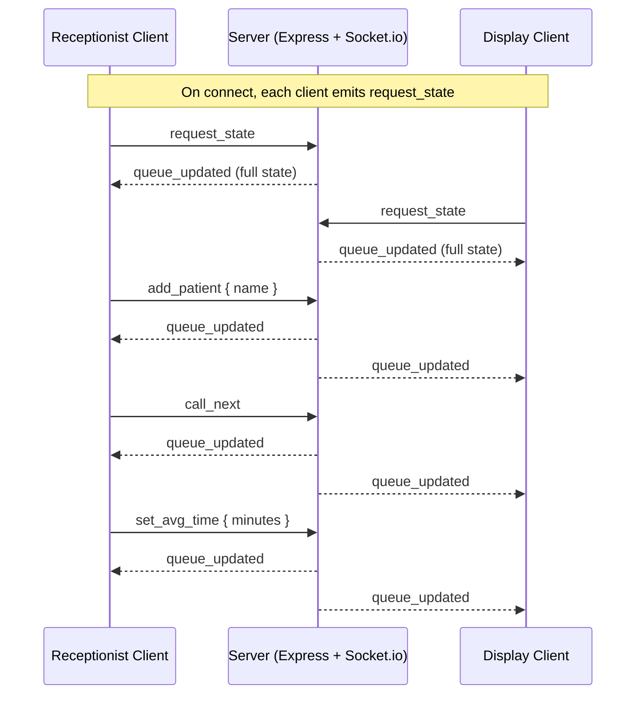

# Socket Event Diagram

## Events
**Client → Server**
- `add_patient` `{ name }` — append a new waiting token
- `call_next` — finish current, promote next waiting to in-progress
- `set_avg_time` `{ minutes }` — update average consultation time
- `request_state` — request a fresh snapshot (used on connect/reconnect)

**Server → Client**
- `queue_updated` — full state object, broadcast after every change
